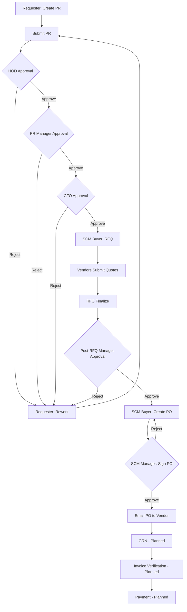

# 02 — Workflow Overview

## 1. Process Flow Diagram

## 2. PR Status Lifecycle

| Status | Description |
|--------|-------------|
| `DRAFT` | PR saved but not submitted |
| `PENDING_HOD` | Awaiting HOD approval |
| `PENDING_PR_MANAGER` | Awaiting PR Manager |
| `PENDING_CFO` | Awaiting CFO |
| `PENDING_RFQ` | Approved for RFQ; SCM Buyer action |
| `RFQ_IN_PROGRESS` | RFQ sent to vendors |
| `PENDING_POST_RFQ` | RFQ finalized; post-RFQ approval |
| `PENDING_PO` | Approved for PO creation |
| `PO_CREATED` | PO draft created |
| `PO_PENDING_SIGN` | Awaiting SCM Manager signature |
| `PO_SIGNED` | PO signed and sent |
| `PO_REJECTED` | PO rejected by SCM Manager |
| `REJECTED` | PR rejected at any approval stage |
| `REWORK` | Sent back to requester |

## 3. Stage Constants

| Stage | Code |
|-------|------|
| Requester | `REQUESTER` |
| HOD | `HOD` |
| PR Manager | `PR_MANAGER` |
| CFO | `CFO` |
| RFQ | `RFQ` |
| Post-RFQ | `POST_RFQ` |
| PO Creation | `PO_CREATION` |
| PO Sign | `PO_SIGN` |

## 4. Approval Record Types

Stored in `pr_approvals` table:

| Action | Description |
|--------|-------------|
| `SUBMITTED` | PR submitted |
| `APPROVED` | Approved at current stage |
| `REJECTED` | Rejected |
| `REWORK` | Sent back for changes |
| `RFQ_SENT` | RFQ invitations sent |
| `RFQ_FINALIZED` | RFQ closed for quotes |
| `PO_CREATED` | PO created by SCM Buyer |
| `PO_UPDATED` | PO edited by SCM Manager before sign |
| `PO_SIGNED` | PO signed by SCM Manager |
| `PO_REJECTED` | PO rejected |

## 5. Email Triggers

| Event | Recipients |
|-------|------------|
| PR submitted | HOD |
| PR approved/rejected | Requester, next approver |
| RFQ sent | Vendors |
| RFQ quote submitted | Requester, SCM Buyer |
| Post-RFQ pending | Post-RFQ approver |
| PO created | SCM Manager |
| PO signed | Vendor (with CC to stakeholders) |
| PO rejected | SCM Buyer |

## 6. Current Configuration Notes

- **Post-RFQ flow:** Only L1 Manager approval is active; L2 and CFO post-RFQ steps are skipped (`POST_RFQ_ROLE_MAP`).
- **Vendor comparison:** Available on RFQ Approval page and SCM Manager PO Approval expanded row.
- **PO document:** Generated from PO Letterhead Master (Short PO / Long PO types).
